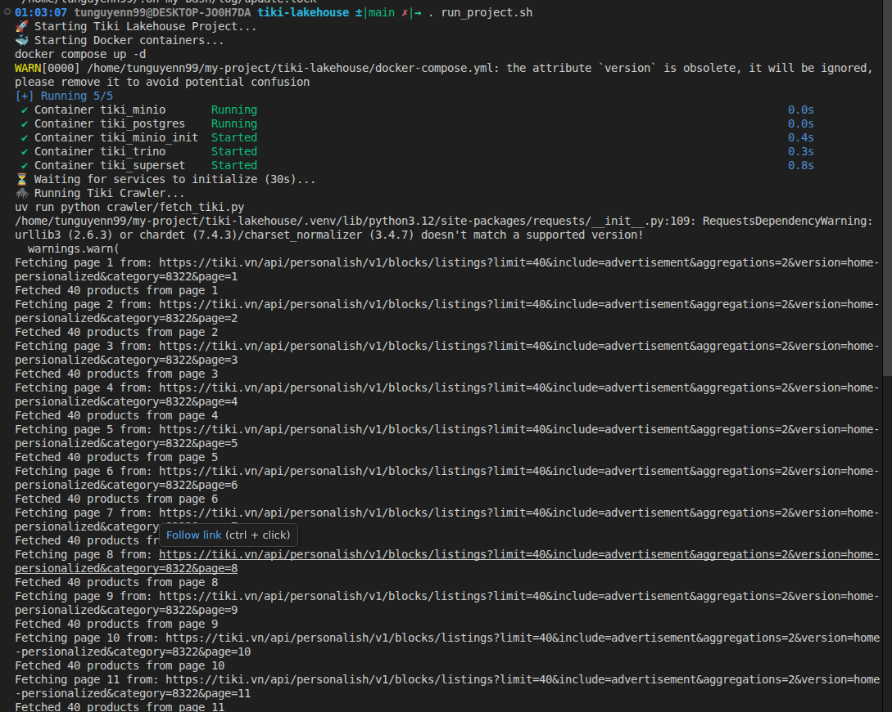
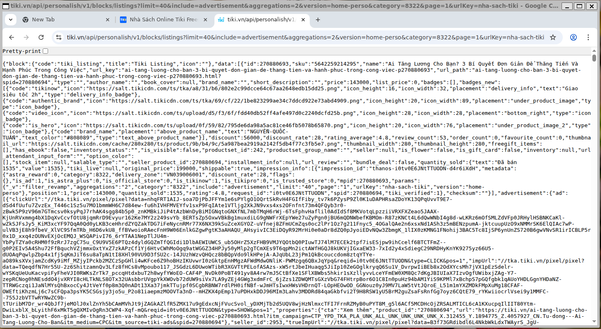
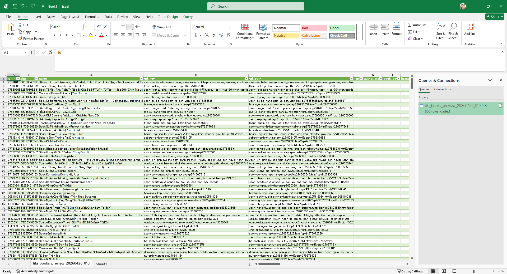
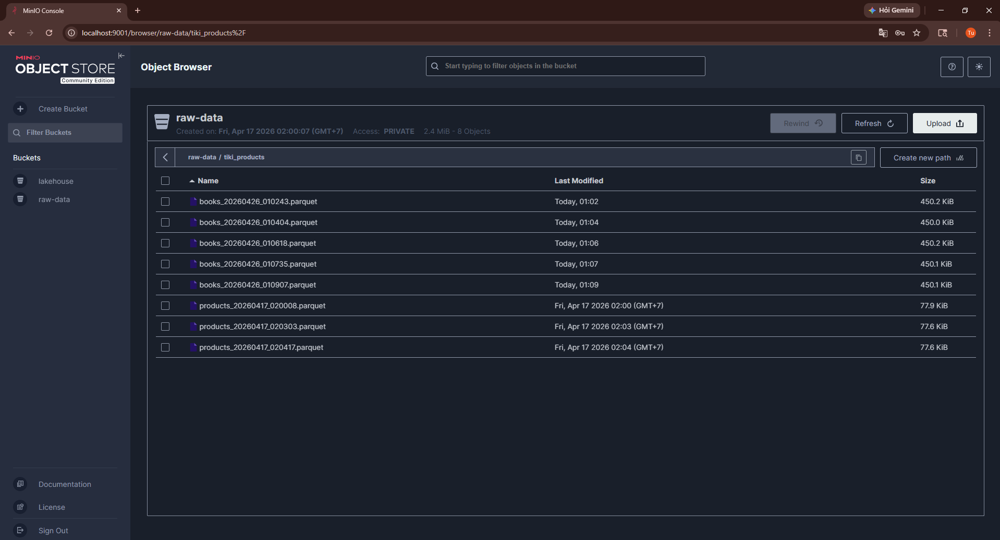
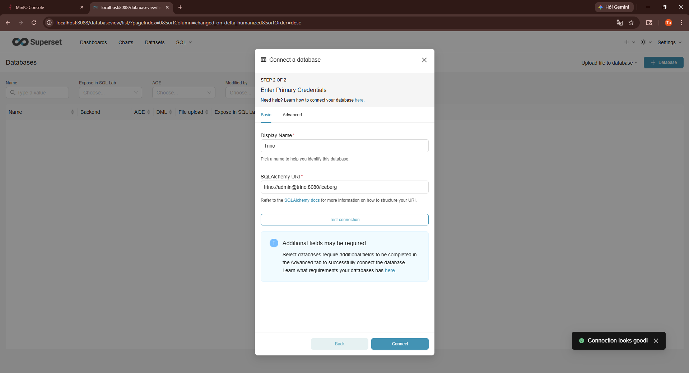
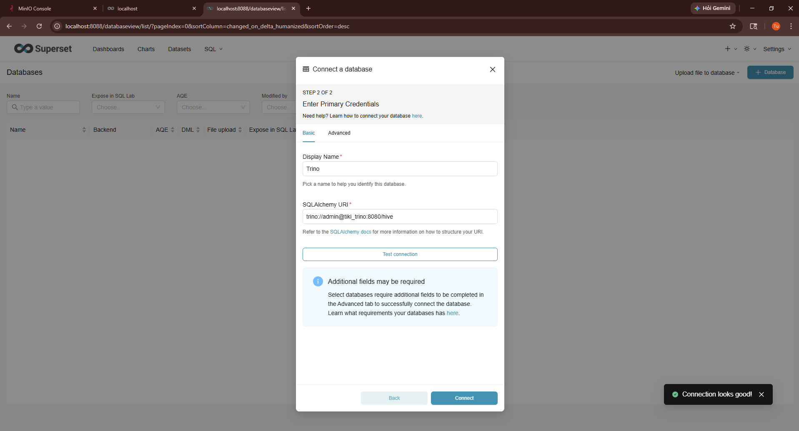
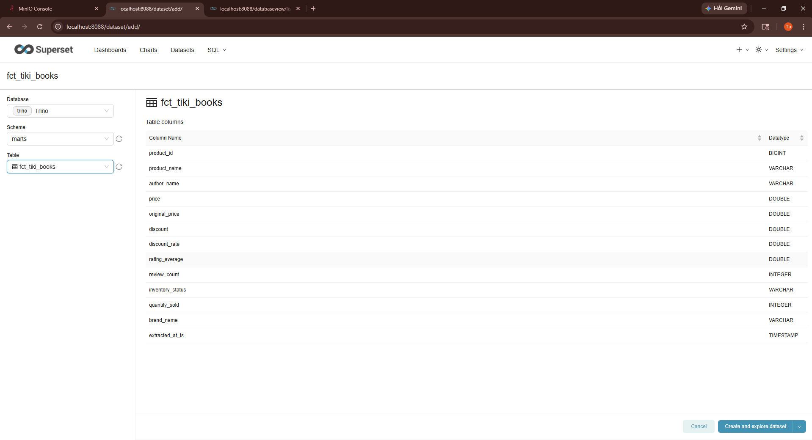
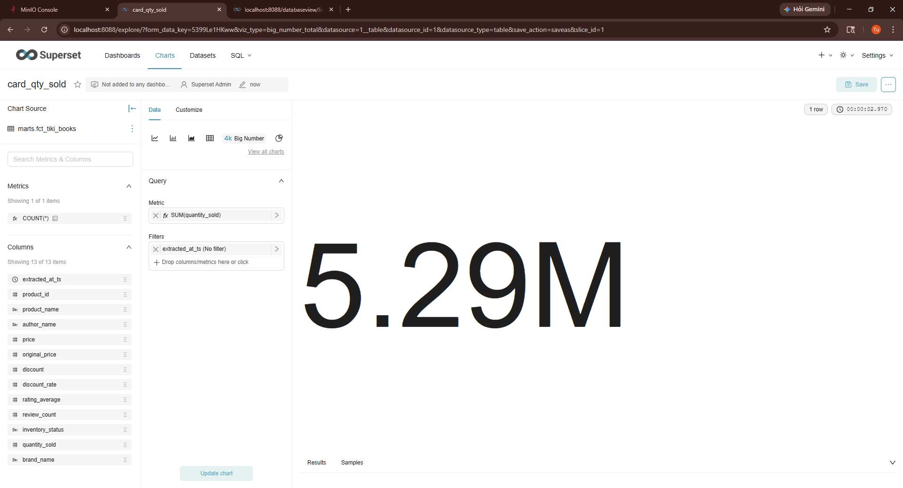
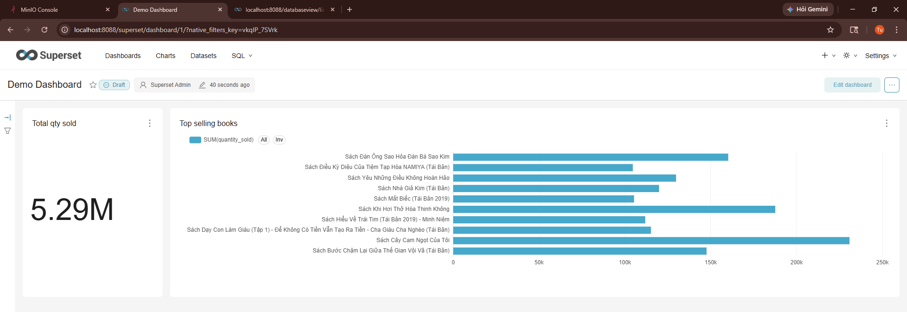
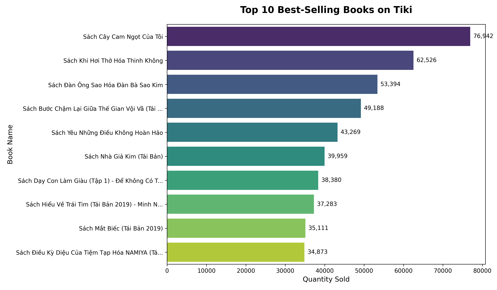

<div align="center">
  <h1>Tiki Lakehouse Project 🌊🛒</h1>
  <p><em>A modern open-source Data Pipeline & Lakehouse simulating E-Commerce operations</em></p>

  []()
  []()
  []()
  []()
</div>

---

## 🛠️ Tech Stack & Architecture

| Component | Technology | Description |
| :--- | :---: | :--- |
| **Ingestion Engine** | 🐍 Python | Custom crawlers scraping Tiki API using `requests` and converting structures to nested `Parquet`. |
| **Data Lake** | 🪣 MinIO | Self-hosted S3-compatible object storage defining our raw and consumption layers. |
| **Data Transformation** | 🔨 dbt + DuckDB | Compiles SQL transformations and materializes external Iceberg/Parquet tables directly in MinIO. |
| **Query Engine** | ⚡ Trino | Distributed SQL Query engine cataloged against MinIO via an Iceberg Postgres Metastore. |
| **Visualization BI** | 📊 Superset | Fast, interactive dashboarding interface mapping to Trino databases. |
| **Package Manager** | ☄️ uv | astral-sh/uv manages blazing fast virtual environments entirely in the project root. |

## 📂 Project Structure

```text
tiki-lakehouse/
├── .github/workflows/       # CI/CD Pipelines (Formatting & dbt linting)
├── crawler/
│   ├── tests/               # Pytest scripts (e.g., test_fetch.py)
│   └── fetch_tiki.py        # Extract & Load script fetching data to MinIO
├── dbt_tiki/                # dbt models, config, and schema rules
│   ├── models/              
│   ├── dbt_project.yml      
│   └── profiles.yml         # Configures DuckDB HTTPFS & S3 AWS extensions
├── trino/                   # Trino deployment files
│   └── etc/                 # Cluster & Iceberg Catalog properties
├── .env.example             # Template for API Keys & Passwords
├── .pre-commit-config.yaml  # Configured to standardize Python and SQL code
├── docker-compose.yml       # Local infrastructure setup (Trino, MinIO, Postgres, Superset)
├── Makefile                 # Shortcuts for `up`, `crawl`, `dbt-run`, `lint`
└── pyproject.toml           # Root package and tool configurations
```

## 🚀 Quick Start

### 1. Launch Infrastructure
Turn on the components using Docker Compose:
```bash
bash run_project.sh
```


*Access Ports:*
- **MinIO Console:** `http://localhost:9001` *(admin / minio_password)*
- **Trino UI:** `http://localhost:8080` *(admin)*
- **Apache Superset:** `http://localhost:8088` *(admin / admin)*

### 2. Prepare Environment
Instantiate the Python virtual environments with `uv` and setup pre-commit hooks:
```bash
cp .env.example .env
# Edit .env file with necessary information
uv sync
```

### 3. Extract & Load Data (Crawl)
Scrape new product arrays immediately into MinIO:
```bash
uv run python crawler/fetch_tiki.py
```



### 4. Transform & Load to Iceberg Lakehouse
Read raw MinIO data, clean complex formats (like stringified dicts), and insert into strongly-typed external Parquet tables via DuckDB/dbt:
```bash
make dbt-run
```


### 5. Visualize in Superset
Connect Superset to the Trino query engine to visualize the Iceberg tables.

1. Go to **Superset** (`http://localhost:8088`).
2. Navigate to **Settings (Gear Icon)** -> **Database Connections** -> **+ DATABASE**.
3. Select **Trino** from the Supported Databases list.
4. Input the following **SQLALCHEMY URI**:
   ```text
   trino://admin@tiki_trino:8080/iceberg
   ```
5. Click **Test Connection**, then **Connect**.
6. Go to **Datasets** -> **+ DATASET** -> Select `Trino` database -> `marts` schema -> `fct_tiki_books` table.
7. Start building your Dashboard!

<p align="center">
  
  
</p>
<p align="center">
  
  
</p>


### 6. Analytics Preview
Here is a generated bar chart showing the top 10 best-selling books directly queried from the data lakehouse using a Python script (`analytics_plot.py`):


---

_Author: @tunguyenn99 - From Xom Data w Luv <3_
